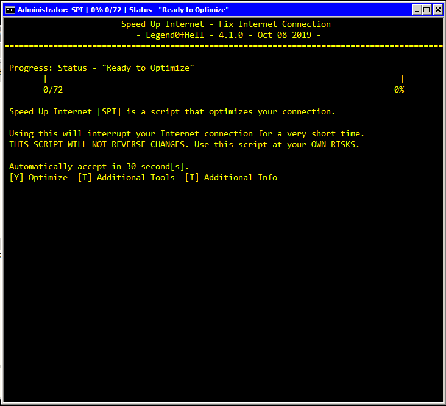
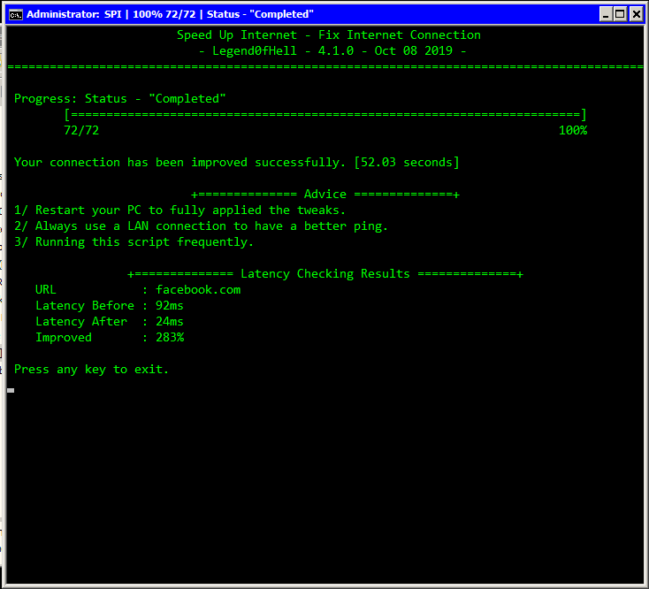

# SPI
**Speed Up Internet** (also called **SPI**) is a **Batch/PowerShell** script that **"fights for the User."**
This script **optimizes your connection** by lots of **verified methods.**

## NOTE
* I'm currently needing **your help**. If you got any suggestion about the script, like the tweaks or the script code itself, **issue** or **make a pull request.**

* **THIS SCRIPT WILL NOT REVERSE CHANGES. Use the script at your OWN RISKS.**

## Getting Started

* To use **SPI**, download the **self-extracting .exe** file above (SPI.exe), run it and it will **extract SPI.cmd, the tools\ folder and the Shortcut** to the current directory.
* Copy **all of them** to the desired directory of the target machine.

## Prerequisites

* **Windows 7** or newer.
* Services related to Internet connection **must be turned on.**

## Usage
One-press optimization. Open by **the given shortcut** for it to work.

## Built with

* [Notepad++] (https://notepad-plus-plus.org/) - The source code editor.
* [PowerCmd] (https://www.powercmd.com/) - The command prompt replacement.

## Authors

* **Pham Nhat Quang** - *Main author* - [Legend0fHell](https://github.com/Legend0fHell/)

## Special Thanks:

* **Nguyen Ba Hung** - *Tester*
* **Tron** - *Tweaks related to Telemetry removal, and my inspiration* - [r/TronScript](https://www.reddit.com/r/TronScript/)
* **SpeedyFox** - *Optimize browsers* - [SpeedyFox](https://www.crystalidea.com/speedyfox/)
* **Everyone in StackOverflow and SuperUser** - *Help me with coding*

## License

* This project is licensed under the **BSD-3 Clause License** - see the [LICENSE.md](LICENSE.md) file for details.
* All 3rd-party tools SPI uses are bound by their respective licenses.
* It is YOUR responsibility to determine if you can use them in your specific situation.

## Acknowledgments

* This script is not contain any malicious codes/viruses.
* All the modules were commented for you to see what SPI does.
* To improve the optimize speed, this script will use multi-task technique, meaning that there will be
several instances running all at once.
* Debugging is always harder than programming, so if you write code as cleverly as you know how, by
definition you will be unable to debug it.

# Full Description [WIP]

## Files

### SPI.cmd
The master file that contains every tweaks and calls external 3rd-party tools.
### config.txt
The configuration file for SPI.
### tools\ folder
Contains external 3rd-party tools and the backup Shortcut.
### output\ folder
Contains the result of some tools in "Additional Tools" menu.

## Stages

### Prep Works
(These works are executed even when SPI is cancelled before running.)
  0. Load the configuration files and set the prompt: Load and validate the configuration in config.txt and set the prompt (variables, width, height, etc.)
  1. Check if the script was run by the given shortcut: The shortcut will help to set the prompt font to echo Vietnamese characters (ă, ự, ớ, etc.), and make sure that the script is running at Admin privellege.
  2. Preloading PowerShell: PowerShell takes a lot of time to open, so SPI will load PowerShell first to save precious time.
  3. Check the Internet connection: Check if the users' PC has connected to the Internet, if not then it'll enable a safe switch io avoid crashing.
  4. Check for browsers' instances: Some tweaks cannot be run without closing all the browsers. If the script detects them, it will ask the users if they want to close the browsers or skip the tweaks that needs to close them.
  
### Stage 1: TCP/IP/DNS
  0. Check the latency before running: Ping the URL set in the configuration file.
  1. Reset WinSock: Recover the computer from any socket errors which arise when you download some unknown file, or due to some malicious executables on the computer.
  ```
  netsh winsock reset
  ```
  2. Reset TCP/IP: Reset the TCP/IP. TCP/IP stands for Transmission Control Protocol/Internet Protocol, it is a type of protocol used to communicate with other computers.
  ```
  netsh int ip reset %HomeDrive%\resetlog.txt
	netsh int ip reset reset.log
  ```
  3. Flush the DNS Cache: Flush the DNS Cache to solve technical problems.
  ```
  ipconfig /flushdns
  ```
  4. Release the IP: Release the IP to reset the connection.
  ```
  ipconfig /release
  ```
  5. Renew the IP: Renew the IP to reset the connection. Multi-tasking this progress because this takes a lot of time.
  ```
  ipconfig /renew
  ```
  6. Delete the ARP Cache: In Windows, the Address Resolution Protocol (ARP) is a critical part TCP/IP network communication. Flush the ARP cache will solve issues with connections not being made, or loss of ping.
  ```
  netsh interface ip delete arpcache
  ```
  7. Disable Receive Segment Coalescing: RSC is offload technology that offloading tasks from the CPU to an RSC-capable network adapter. CPU saturation due to networking-related processing can limit server scalability. This problem in turn reduces the transaction rate, raw throughput, and efficiency.
  ```
  netsh int tcp set global rsc=disabled
	Set-NetOffloadGlobalSetting -ReceiveSegmentCoalescing disabled;
  ```
  8. Disable Packet Coalescing: Packet Coalescing is used to group both random and multicast traffic for efficiency. This should be disabled for gaming and where lower latency is desired at the expense of a bit higher CPU utilization.
  ```
  Set-NetOffloadGlobalSetting -PacketCoalescingFilter disabled;
  ```
  9. Disable Checksum Offload: Checksum Offload involves computing these checksums below the IP stack; thus the driver or NIC firmware must partially dismantle the IP header in order to compute a correct checksum. It can cause havoc to the NIC drivers.
  ```
  Disable-NetAdapterChecksumOffload -Name *;
  ```
  10. Disable Large Send Offload: When enabled, the network adapter hardware is used to complete data segmentation, theoretically faster than operating system software. Its buggy implementation on many levels, including Network Adapters can cause errors.
  ```
  Disable-NetAdapterLso -Name *;
  ```
  11. Disable RFC 1323 Timestamps: "Timestamps" is intended to increase transmission reliability by retransmitting segments that are not acknowledged within some retransmission timeout (RTO) interval. The problem with timestamps is that they add 12 bytes to the 20-byte TCP header of each packet, so turning them on causes considerable overhead.
  ```
  netsh int tcp set global timestamps=disabled
  ```
  12. Set Initial RTO to 2500ms: Retransmit timeout (RTO) determines how many ms of unacknowledged data it takes before the connection is aborted. The default timeout for Initial RTO of 3000ms can usually be lowered for low-latency modern broadband connections.
  ```
  netsh int tcp set global initialRto=2500
  ```
  13. WIP

# Screenshots



