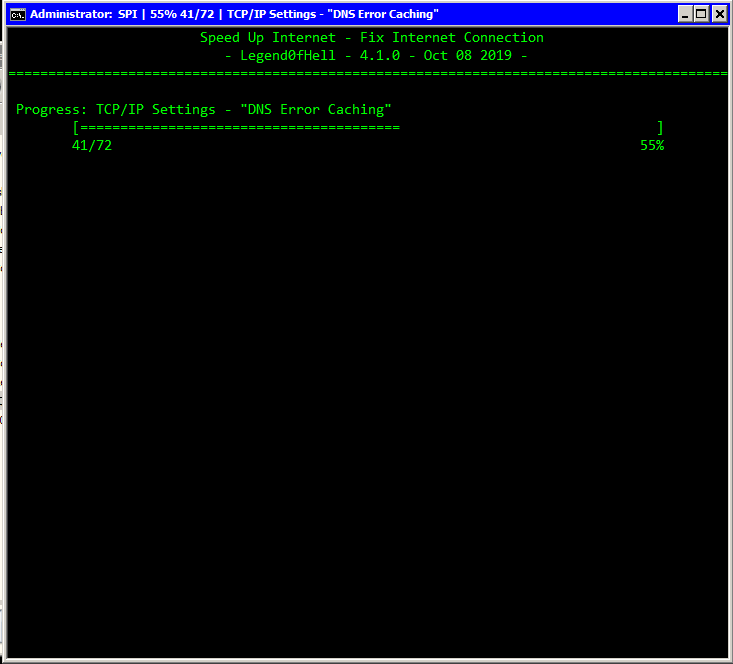

# SPI
**Restart Internet Connection** (Formerly known as **SPI**) is a **Batch/PowerShell** script that **restart the connection**, and also **optimizes your connection** by lots of **verified methods.**

## NOTE

* This script only works with **Windows 7 and above**. Not recommended for all versions of Windows Server.

* ~~THIS SCRIPT WILL NOT REVERSE CHANGES. Use the script at your OWN RISKS~~ I'm currently working on this feature.

* Latest revision: v4.2.2 @ Apr 26 2020

## Getting Started

* To use **SPI**, download the **self-extracting .exe** file above (SPI.exe), run it and it will **extract SPI.cmd, the tools\ folder and the Shortcut** to the current directory.
* Copy **all of them** to the desired directory of the target machine.

## Prerequisites

* **Windows 7** or newer.
* Services related to Internet connection **must be turned on.**

## Usage
One-press optimization. Open by **the given shortcut** for it to work.

## Built with

* [Notepad++] (https://notepad-plus-plus.org/) - The source code editor.
* [PowerCmd] (https://www.powercmd.com/) - The command prompt replacement.

## Authors

* **Legend0fHell** - *Main author* - [GitHub](https://github.com/Legend0fHell/)

## Special Thanks:

* **Tron** - *Tweaks related to Telemetry removal, and my inspiration* - [r/TronScript](https://www.reddit.com/r/TronScript/)
* **SpeedyFox** - *Optimize browsers* - [SpeedyFox](https://www.crystalidea.com/speedyfox/)
* **Everyone in StackOverflow and SuperUser** - *Help me with coding*

## License

* This project is licensed under the **BSD-3 Clause License** - see the [LICENSE.md](LICENSE.md) file for details.
* All 3rd-party tools SPI uses are bound by their respective licenses.
* It is YOUR responsibility to determine if you can use them in your specific situation.

## Acknowledgments

* This script is not contain any malicious codes/viruses.
* All the modules were commented clearly.
* To improve the optimize speed, this script will use multi-task technique, meaning that there will be
several instances running all at once.
* Debugging is always harder than programming, so if you write code as cleverly as you know how, by
definition you will be unable to debug it.

# Full Description [WIP]

## Files

### SPI.cmd
The master file that contains every tweaks and calls external 3rd-party tools.
### config.txt
The configuration file for SPI.
### tools\ folder
Contains external 3rd-party tools and the backup Shortcut.
### output\ folder
Contains the result of some tools in "Additional Tools" menu.

## Stages

### Prep Works
(These works are executed even when SPI is cancelled before running.)

  0. Load the configuration files and set the prompt: Load and validate the configuration in config.txt and set the prompt (variables, width, height, etc.)
  1. Check if the script was run by the given shortcut: The shortcut will help to set the prompt font to echo Vietnamese characters (ă, ự, ớ, etc.), and make sure that the script is running at Admin privellege.
  2. Preloading PowerShell: PowerShell takes a lot of time to open, so SPI will load PowerShell first to save precious time.
  3. Check the Internet connection: Check if the users' PC has connected to the Internet, if not then it'll enable a safe switch io avoid crashing.
  4. Check for browsers' instances: Some tweaks cannot be run without closing all the browsers. If the script detects them, it will ask the users if they want to close the browsers or skip the tweaks that needs to close them.
  
### Stage 1: TCP/IP/DNS
  0. Check the latency before running: Ping the URL set in the configuration file.
  1. Reset WinSock: Recover the computer from any socket errors which arise when you download some unknown file, or due to some malicious executables on the computer.
  ```
  netsh winsock reset
  ```
  2. Reset TCP/IP: Reset the TCP/IP. TCP/IP stands for Transmission Control Protocol/Internet Protocol, it is a type of protocol used to communicate with other computers.
  ```
  netsh int ip reset %HomeDrive%\resetlog.txt
  netsh int ip reset reset.log
  ```
  3. Flush the DNS Cache: Flush the DNS Cache to solve technical problems.
  ```
  ipconfig /flushdns
  ```
  4. Release the IP: Release the IP to reset the connection.
  ```
  ipconfig /release
  ```
  5. Renew the IP: Renew the IP to reset the connection. Multi-tasking this progress because this takes a lot of time.
  ```
  ipconfig /renew
  ```
  6. Use the custom template: Windows will use the custom template. (In Windows 8, the custom template is called Custom, while in Windows 8.1 and 10 it is called InternetCustom. Windows 7 is not supported.)
  ```
  netsh int tcp set supplemental Custom
  netsh int tcp set supplemental InternetCustom
  ```
  7. Delete the ARP Cache: In Windows, the Address Resolution Protocol (ARP) is a critical part TCP/IP network communication. Flush the ARP cache will solve issues with connections not being made, or loss of ping.
  ```
  netsh interface ip delete arpcache
  ```
  8. Disable Receive Segment Coalescing: RSC is offload technology that offloading tasks from the CPU to an RSC-capable network adapter. CPU saturation due to networking-related processing can limit server scalability. This problem in turn reduces the transaction rate, raw throughput, and efficiency.
  ```
  netsh int tcp set global rsc=disabled
  Set-NetOffloadGlobalSetting -ReceiveSegmentCoalescing disabled;
  ```
  9. Disable Packet Coalescing: Packet Coalescing is used to group both random and multicast traffic for efficiency. This should be disabled for gaming and where lower latency is desired at the expense of a bit higher CPU utilization.
  ```
  Set-NetOffloadGlobalSetting -PacketCoalescingFilter disabled;
  ```
  10. Enable Checksum Offload: Checksum Offload involves computing these checksums below the IP stack; thus the driver or NIC firmware must partially dismantle the IP header in order to compute a correct checksum. It is also required for some other offloads to work.
  ```
  Enable-NetAdapterChecksumOffload -Name *;
  ```
  11. Disable Large Send Offload: When enabled, the network adapter hardware is used to complete data segmentation, theoretically faster than operating system software. Its buggy implementation on many levels, including Network Adapters can cause errors.
  ```
  Disable-NetAdapterLso -Name *;
  ```
  12. Disable RFC 1323 Timestamps: "Timestamps" is intended to increase transmission reliability by retransmitting segments that are not acknowledged within some retransmission timeout (RTO) interval. The problem with timestamps is that they add 12 bytes to the 20-byte TCP header of each packet, so turning them on causes considerable overhead.
  ```
  netsh int tcp set global timestamps=disabled
  ```
  13. Set Initial RTO to 2500ms: Retransmit timeout (RTO) determines how many ms of unacknowledged data it takes before the connection is aborted. The default timeout for Initial RTO of 3000ms can usually be lowered for low-latency modern broadband connections.
  ```
  netsh int tcp set global initialRto=2500
  ```
  14. Set Min RTO to 300ms: Same as above. Min RTO can't be changed under Windows 8 (read-only error).
  ```
  set-NetTCPSetting -SettingName InternetCustom -MinRto 300;
  ```
  15. Set the Add-On Congestion Control Provider (CTCP): A regular network connection will send data in small blocks initially, increasing these only gradually to help avoid network congestion. CTCP takes a different approach, ramping up your TCP window size much more aggressively, so enabling CTCP may improve performance.
  ```
  netsh int tcp set global congestionprovider=ctcp
  Set-NetTCPSetting -SettingName InternetCustom -CongestionProvider CTCP;
  netsh int tcp set supplemental custom congestionprovider=ctcp
  ```
  16. Enable ECN: Explicit Congestion Notification provides routers with an alternate method of communicating network congestion. It is aimed to decrease retransmissions.
  ```
  netsh int tcp set global ecn=enabled
  ```
  17. Disable Scaling Heuristics: Prevent it from restricting the Window Auto-Tuning Level, which is set below.
  ```
  netsh int tcp set heuristics disabled
  ```
  18. Set Receive Window Auto-Tuning Level to Normal: It has a very important role in TCP connections. It can control throughput, especially in high-speed, high-latency environments.
  ```
  netsh int tcp set global autotuninglevel=normal
  ```
  19. Disable TCP Chimney Offload: TCP Chimney Offload will offload all TCP processing for a connection to a network adapter (with proper driver support). Enabling this setting had some negative effects in the past because of buggy network adapter drivers. It is now considered deprecated by Microsoft.
  ```
  netsh int tcp set global chimney=disabled
  ```
  20. Enable RSS (Receive-Side Scaling State): It enables parallelized processing of received packets on multiple processors, while avoiding packet reordering. This approach ensures that all packets belonging to a given TCP connection will be queued to the same processor, in the same order that they were received by the network adapter.
  ```
  netsh int tcp set global rss=enabled
  netsh interface tcp set heuristics wsh=enabled
  ```
  21. Enable Direct Cache Access: Direct Cache Access (DCA) allows a capable I/O device, such as a network controller, to place data directly into CPU cache, reducing cache misses and improving application response times.
  ```
  netsh int tcp set global dca=enabled
  ```
  22. Enable Non SACK RTT Resiliency: This can help slow clients/connections as it makes TCP/IP less aggressive in retransmitting packets when enabled. (Windows 8.1)
  ```
  netsh int tcp set global nonsackrttresiliency=enabled
  ```
  23. Set Max SYN Retransmissions to 2: The number of times to attempt to re-establish a connection with SYN packets. (Windows 8.1)
  ```
  netsh int tsp set global maxsynretransmissions=2
  ```
  24. Set Initial Congestion Window (initcwnd) to 10: It is used during the start of a TCP connection. During the start of a HTTP session, when a client requests for a resource, the servers initcwnd determines how many data packets will be sent during the initial burst of data. If the initcwnd values is large, then there will be fewer RTTs required to download the same file. But we cannot set initcwnd to a huge value as the network environment and the routers also has the limitation of having limited buffers. If exceedingly large values are set, it may lead to router buffer overflows, packet loss, packet re-transmissions. CDNs keep updating their initcwnd values over the years as the Network space and Web environment evolves. CloudFlare (1.1.1.1) set their to 10 (updated in 2017).
  ```
  Set-NetTCPSetting -SettingName InternetCustom -InitialCongestionWindow 10;
  netsh int tcp set supplemental template=custom icw=10
  netsh int tcp set supplemental template=InternetCustom icw=10
  ```
  25. Disable Memory Pressure Protection: Memory Pressure Protection is all about DDoS defense. Disable it to minimize CPU usage as it's only needed in Internet servers.
  ```
  netsh int tcp set security mpp=disabled
  netsh int tcp set security profiles=disabled
  ```
  26. Enable Auto-Tuning: Auto-tuning enables dynamic send buffering for overall better throughput.
  ```
  netsh winsock set autotuning on
  ```
  27. Set Maximum Transmission Unit to 1492: MTU (Maximum Transmission Unit) is the greatest amount of data that can be transferred in one physical frame on the network. If a packet that has a smaller MTU than the packet's frame length is sent, fragmentation will occur. For TCP (Transmission Control Protocol) MTU can range from 68 to 1500 bytes. Larger MTUs provide for lower overhead (fewer headers). (Needed to rework)
  ```
  netsh int ipv4 set subinterface "<interfaceName>" mtu=1492 store=persistent
  ```
  28. Set DefaultTTL to 64: It is a limit to the time and number of hops/routers a packet will travel before being discarded. A number that's too small (below 32) risks packets being discarded before reaching their destination. A number that's too large (over 128) will cause delay in when lost IP packets are discarded.
  ```
  reg add "HKEY_LOCAL_MACHINE\SYSTEM\CurrentControlSet\Services\Tcpip\Parameters" /v DefaultTTL /t REG_DWORD /d "64" /f
  ```
  29. Set MaxUserPort to 65534: Short lived (ephemeral) TCP/IP ports above 1024 are allocated as needed by the OS. The Windows 8/2012 defaults are usually sufficient under normal network load. However, under heavy network load it may be necessary to adjust this registry setting to increase port availability.
  ```
  reg add "HKEY_LOCAL_MACHINE\SYSTEM\CurrentControlSet\Services\Tcpip\Parameters" /v MaxUserPort /t REG_DWORD /d "65534" /f
  ```
  30. Set TCPTimedWaitDelay to 30: Combine with the above tweak to decrease the time to wait before reclaiming unused ports.
  ```
  reg add "HKEY_LOCAL_MACHINE\SYSTEM\CurrentControlSet\Services\Tcpip\Parameters" /v TcpTimedWaitDelay /t REG_DWORD /d "30" /f
  ```
  31. WIP
# Screenshots



